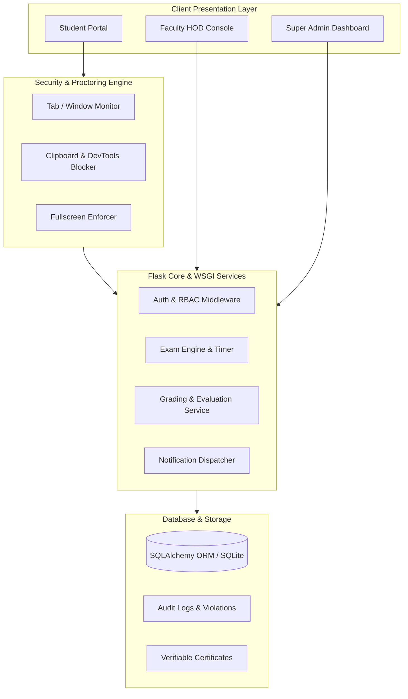

<div align="center">

# 🏛️ Apex Institute of Engineering & Technology
### Enterprise Online Examination, Proctoring & Academic Governance Portal

[](https://apex-institute-of-engineering-technology.onrender.com)
[](https://www.python.org/)
[](https://flask.palletsprojects.com/)
[](https://www.sqlalchemy.org/)
[](#-anti-cheat--proctoring-suite)

<br/>

**A full-stack, enterprise-grade academic examination and governance platform designed for universities and engineering institutions, featuring real-time proctoring, multi-department scoping, dynamic question banks, automated evaluation, and verifiable certificate issuance.**

[Explore Live Portal](https://apex-institute-of-engineering-technology.onrender.com) • [Report Issue](https://github.com/Kushwaha1210/Apex-Institute-of-Engineering-Technology/issues) • [Request Feature](https://github.com/Kushwaha1210/Apex-Institute-of-Engineering-Technology/issues)

</div>

---

## 📌 Executive Summary

The **Online Examination System (OES)** provides a unified ecosystem for administering university-level computer-based examinations across multiple engineering disciplines. Built with an emphasis on **academic integrity**, **real-time scalability**, and **modern visual design**, the platform bridges the gap between academic governance (Deans & HODs) and candidate evaluations.

---

## 🌟 Key Functional Pillars

### 1. 🏛️ Multi-Discipline Academic Governance
- **Comprehensive 9-Department Support**: Dedicated namespaces and curriculum management for:
  - *Computer Science & Engineering (CSE)*
  - *Information Technology (IT)*
  - *Artificial Intelligence & Data Science (AI&DS)*
  - *Cyber Security & Digital Forensics (CY)*
  - *Electronics & Communication Engineering (ECE)*
  - *Electrical Engineering (EE)*
  - *Mechanical Engineering (ME)*
  - *Civil Engineering (CE)*
  - *Biotechnology Engineering (BT)*
- **Hierarchical Scoping**: Faculty HODs manage department-specific question repositories and candidate registries, while Super Admins oversee global university metrics.

### 2. 🛡️ Anti-Cheat & Proctoring Suite
- **Tab & Window Focus Tracking**: Detects browser minimization, background switching, and application unfocus events in real-time.
- **Strict Fullscreen Enforcement**: Monitors fullscreen exit triggers and logs infractions.
- **Clipboard & Context Security**: Disables context menus, copy/paste operations, keyboard shortcuts (`Ctrl+C`, `Ctrl+V`, `F12`, `PrintScreen`), and text selection.
- **Violation Logging**: Real-time violation counters that automatically submit or flag sessions exceeding institutional thresholds.

### 3. ⏱️ Dynamic Exam Engine & Automated Grading
- **Custom Exam Parameters**: Configurable durations, passing criteria, negative marking penalties, question shuffling, and multi-attempt rules.
- **Interactive Exam Navigation**: Floating question palettes with instant status indicators (*Answered*, *Flagged for Review*, *Unanswered*).
- **Instant Result Evaluation**: Deterministic scoring algorithms with detailed per-question analytics and explanation breakdowns.

### 4. 📜 Cryptographically Verifiable Certifications
- **Automated Issuance**: Instant generation of official completion certificates upon meeting passing thresholds.
- **Public Verification**: Unique certificate identification codes and cryptographic verification records.

---

## 🏗️ System Architecture & Workflow



---

## 🛠️ Technology Stack Matrix

| Domain | Technologies Used |
| :--- | :--- |
| **Backend Framework** | Python 3.10+, Flask 3.0, Flask-Login, Werkzeug |
| **Database & ORM** | SQLite, SQLAlchemy 2.0 (ACID Compliant) |
| **Production WSGI** | Gunicorn (High-concurrency Worker Model) |
| **Deployment & Hosting** | Render Cloud Platform (PaaS) |
| **Frontend Architecture** | Semantic HTML5, Vanilla JavaScript (ES6+), Vanilla CSS3 |
| **Visual Design System** | Custom Glassmorphism Design System, WebGL 3D Particles, 3D Perspective Carousels |
| **Security Standards** | PBKDF2 Password Hashing, CSRF Protection, Client Event Tamper Detection |

---

## 🚀 Local Installation & Setup

### Prerequisites
- Python `3.10` or higher installed
- Git installed on your system

### 1. Clone the Repository
```bash
git clone https://github.com/Kushwaha1210/Apex-Institute-of-Engineering-Technology.git
cd Apex-Institute-of-Engineering-Technology
```

### 2. Create and Activate a Virtual Environment
```bash
# Windows (PowerShell)
python -m venv venv
.\venv\Scripts\Activate.ps1

# Linux / macOS
python3 -m venv venv
source venv/bin/activate
```

### 3. Install Required Dependencies
```bash
pip install -r requirements.txt
```

### 4. Initialize Database & Seed Baseline Data
```bash
python seed_data.py
```

### 5. Launch the Application
```bash
# Development Mode
python app.py

# Production Mode (Gunicorn)
gunicorn app:app
```

Open your browser and navigate to:
```
http://127.0.0.1:5000
```

---

## 📁 Repository Structure

```
Apex-Institute-of-Engineering-Technology/
│
├── routes/                      # Application blueprints and route controllers
│   ├── admin.py                 # Academic governance, Question Bank & Exam builder
│   ├── auth.py                  # Authentication, registration & roll number generation
│   ├── main.py                  # Landing page & public analytics
│   └── student.py               # Candidate exam engine, proctoring & history
│
├── static/                      # Static assets
│   ├── css/
│   │   └── styles.css           # Design tokens, glassmorphism & responsive layouts
│   └── js/
│       ├── exam.js              # Proctoring engine & exam timers
│       ├── perspective_carousel.js  # 3D coverflow carousel controller
│       └── webgl_bg.js          # Interactive WebGL 3D background
│
├── templates/                   # Jinja2 template architecture
│   ├── admin/                   # Governance & faculty management templates
│   ├── auth/                    # Login, registration & user profile
│   ├── errors/                  # Custom 404 & 500 status views
│   ├── student/                 # Exam player, results & certificates
│   └── base.html                # Universal layout shell & navigation
│
├── app.py                       # Application factory & entry point
├── config.py                    # Application configuration parameters
├── models.py                    # SQLAlchemy database schemas & entity models
├── seed_data.py                 # Dataset seeder for disciplines & exams
├── requirements.txt             # Production package dependencies
├── Procfile                     # Cloud WSGI process configuration
└── render.yaml                  # Automated cloud deployment blueprint
```

---

## 🔒 Security & Privacy Practices

- **Strict Role-Based Authorization**: Endpoints are protected via role-verified route decorators preventing privilege escalation.
- **Password Cryptography**: Passwords are never stored in plain text and are hashed using salted cryptographic routines (`Werkzeug.security`).
- **Session Protection**: Flask sessions are cryptographically signed with unique application secret keys.
- **Exam Isolation**: Candidate answers are stored server-side with atomic transaction commits to prevent data loss.

---

## 📄 License & Attribution

This project is open-source and developed for **Apex Institute of Engineering & Technology**.

<div align="center">
  <sub>Developed by <b>Sumit Kushwaha</b></sub>
</div>
